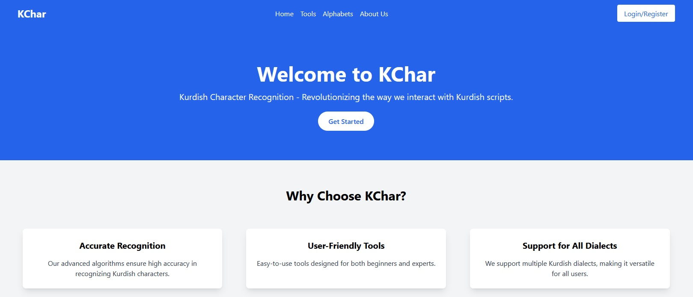
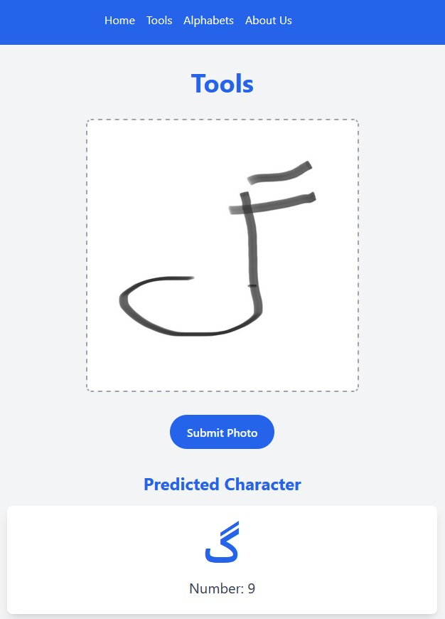

# KChar



KChar is a web-based application built with **React** (frontend) and **Django** (backend) for recognizing Kurdish characters from uploaded or camera-captured images. This tool helps users quickly identify Kurdish letters from images using OCR technology.

## Features
- Upload an image or take a picture using a camera to recognize Kurdish characters.
- View and learn all Kurdish alphabets.
- User authentication (Login/Register).
- Informational pages about the project and its tools.

## Pages

### Home Page
The **Home Page** provides an introduction to KChar, its features, and how users can utilize the platform to recognize Kurdish characters efficiently.

---

### Tools Page



The **Tools Page** is the core feature of KChar. Here, users can:
- Upload an image containing Kurdish characters.
- Capture an image using their device camera.
- Get an instant prediction of the recognized Kurdish characters (Model is not included in this repository. Contact us for access.)

---

### Alphabets Page
The **Alphabets Page** contains all Kurdish alphabets, allowing users to view and learn each character in an organized manner.

---

### About Us Page
The **About Us Page** provides information about the purpose of KChar, its development, and its creators.

---

### Login/Register Page
Users can create an account or log in to access additional features and track their character recognition history.

## Tech Stack
- **Frontend**: React.js
- **Backend**: Django (REST Framework)
- **Database**: SQLite

## Installation & Setup
To run KChar locally, follow these steps:

### Backend (Django)
```bash
# Clone the repository
git clone https://github.com/yourusername/kchar.git
cd kchar/backend

# Create virtual environment
python -m venv venv
source venv/bin/activate  # On Windows use `venv\Scripts\activate`

# Run Django server
python manage.py runserver
```

### Frontend (React)
```bash
cd ../frontend

# Install dependencies
npm install

# Start React app
npm start
```

## Model Access
The character recognition model is not included in this repository. If you need access, please contact us via email.

## Contributing
We welcome contributions! Feel free to fork the repo, open issues, or submit pull requests.

## License
This project is licensed under the MIT License.

## Contact
For any inquiries, contact us at [your-email@example.com].


